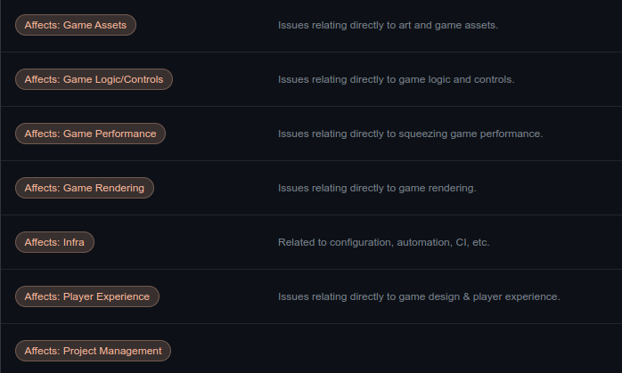
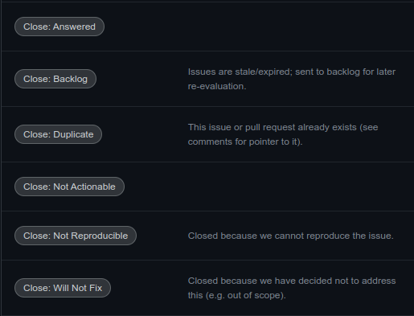
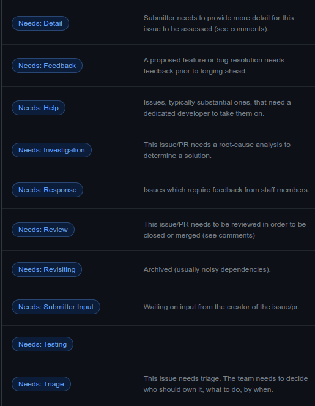
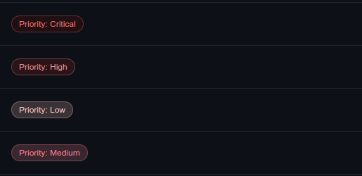
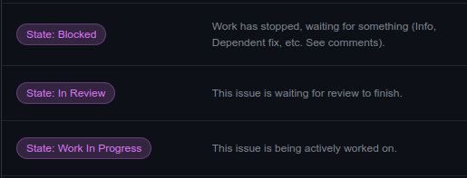
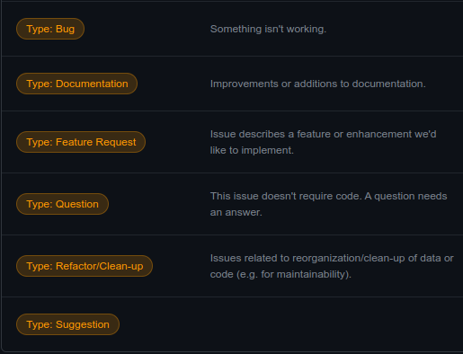
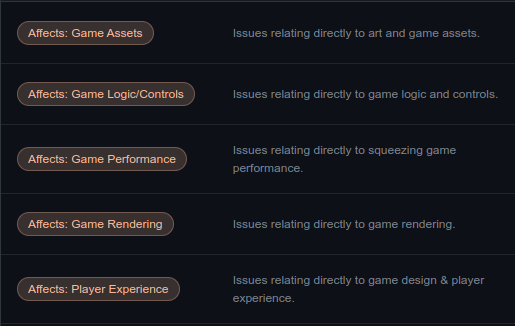

<div align="center">
    
    <h1>ghlabel</h1>
    <p>CLI tool to help setup Github Labels from a yaml/json config file.</p>
    <p>
        
        
        <a href="https://www.python.org/"></a>
        <a href="https://peps.python.org/pep-0008/"></a>
        <a href="https://github.com/seyLu/ghlabel/blob/main/LICENSE"></a>
    </p>
    <p>
        <a href="https://github.com/seyLu/ghlabel/issues/new">Report Bug</a>
        ·
        <a href="https://github.com/seyLu/ghlabel/issues/new">Request Feature</a>
        ·
        <a href="https://github.com/seyLu/ghlabel/discussions">Ask Question</a>
    </p>
</div>

<br>

### Installation and Setup

It is recommended to not install the CLI tool globally.

#### 1. Create a new directory where you want the configuration to live

```bash
mkdir ghlabel

# this is where the labels config will be located
cd ghlabel
```

#### 2. Create and activate virtual environment

```bash
python -m venv .venv

# Linux/Mac
. .venv/bin/activate

# Windows
.venv\Scripts\activate.bat
```

#### 3. Install package

```bash
pip install ghlabel

# check if installed
ghlabel -v
```

#### 4. Create `.env` and supply github credentials

```bash
# Linux/Mac
touch .env

# Windows
type nul > .env
```

```bash
GITHUB_PERSONAL_ACCESS_TOKEN=<your_github_personal_access_token>
GITHUB_REPO_OWNER=<target_github_repository_owner>
GITHUB_REPO_NAME=<target_github_repository_name>
```

<br>

### Basic Usage

#### 1. Generate labels config

```bash
ghlabel dump
```

#### 2. Setup labels in GitHub

```bash
ghlabel setup
```

<br>

For advanced usage, see:
```bash
ghlabel -h
```

<br>
<br>

## :red_circle: `ghlabel`

Setup Github Labels from a yaml/json config file.

### Usage:

```console
$ ghlabel [OPTIONS] COMMAND [ARGS]...
```

<br>

### :large_orange_diamond: Options:

#### `--version`, `-v`
Show version and exit.
#### `--debug`, `-D`
Enable debug mode and show logs.
#### `--help`, `-h`
Show this message and exit.

<br>

### Commands:

#### `dump`
Generate starter labels config files.
#### `setup`
Add/Remove Github labels from config files.

<br>

## :red_circle: `ghlabel dump`

Generate starter labels config files.

### Usage:

```console
$ ghlabel dump [OPTIONS]
```

<br>

### :large_orange_diamond: Options:

#### `--new`, `-n` / `--keep-old-labels`, `-N` [default: new]
Deletes all files in labels dir.
#### `--dir`, `-d TEXT` [default: labels]
Specify the dir where to find labels.
#### `--ext`, `-e [json|yaml]` [default: yaml]
Label file extension.
#### `--app`, `-a [app|game|web]` [default: app]
App to determine label template.
#### `--help`, `-h`
Show this message and exit.

<br>

## :red_circle: `ghlabel setup`

Add/Remove Github labels from config files.

### Usage:

```console
$ ghlabel setup [TOKEN] [REPO_OWNER] [REPO_NAME] [OPTIONS]
```

<br>

### :large_blue_diamond: Arguments:

#### `TOKEN` [optional]
#### `REPO_OWNER` [optional]
#### `REPO_NAME` [optional]

<br>

### :large_orange_diamond: Options:

#### `--dir`, `-d TEXT` [default: labels]
Specify the dir where to find labels.
#### `--strict`, `-s` / `--no-strict`, `-S` [default: no-strict]
Strictly mirror Github labels from labels config.
#### `--add-labels`, `-a TEXT`
Add more labels.
#### `--remove-labels`, `-r TEXT`
Remove more labels.
#### `--remove-all`, `-R [disable|enable|silent]`  [default: disable]
Remove all Github labels.
#### `--help`, `-h`
Show this message and exit.

<br>

### Example Usage

#### Overriding `.env` or Manually adding Environment Variables

```bash
REPO_NAME=medrec ghlabel setup
```

#### Removing more labels

```bash
# -r [comma-separated string]
# will be parsed as list[str]
ghlabel setup -r "Type: Feature Request, Type: Bug"
```

#### Adding more labels

```bash
# -a [valid json string]
# will be parsed as list[dict[str, str]]
ghlabel setup -a "[{'name': 'wontfix', 'color': '#ffffff'}, {'name': 'bug', 'color': '#d73a4a', 'description': 'Something isn't working'}]"
```

<br>

### Adding Custom Github Labels

#### valid values (yaml/json)

```yaml
# yaml
- name: <label_name>
  color: <label_color_hash>
  description: <label_description>
```
```yaml
# json
[
  {
    "name": <label_name>,
    "color": <label_color_hash>,
    "description": <label_description>
  }
]
```

#### labels/affects_labels.yaml


#### labels/close_labels.yaml


#### labels/default_labels.yaml


#### labels/needs_labels.yaml


#### labels/priority_labels.yaml


#### labels/state_labels.yaml


#### labels/type_labels.yaml


### Removing labels

#### labels/_remove_labels.yaml
```yaml
- bug
- dependencies
- documentation
- duplicate
- enhancement
- github_actions
- help wanted
- invalid
- python
- question
- wontfix
```

### [Optional] Game Dev Additional Labels

#### labels/affects_labels.yaml

