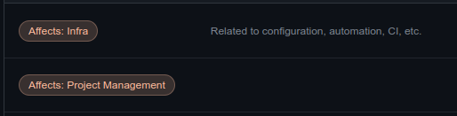

<div align="center">
    
    <h1Github Label CLI</h1>
    <p>CLI tool to help setup Github Labels from a yaml/json config file.</p>
    <p>
        <a href="https://github.com/seyLu/setup-issue-label-cli/issues/new">Report Bug</a>
        ·
        <a href="https://github.com/seyLu/setup-issue-label-cli/issues/new">Request Feature</a>
        ·
        <a href="https://github.com/seyLu/setup-issue-label-cli/discussions">Ask Question</a>
    </p>
</div>

<br>

### Supported Python version

```bash
python==3.11
```

<br>

### Usage

#### 1. Clone the repo

```bash
git clone git@github.com:seyLu/setup-github-label-cli.git
```

#### 2. Install dependencies

##### Create a new virtual environment

```bash
python -m venv .venv
```

##### Activate the virtual environment

```bash
# Linux/Mac
. .venv/bin/activate

# Windows
.venv\Scripts\activate.bat
```

##### Install dependencies from requirements.txt

```bash
pip install -r requirements.txt
```

#### 3. Create `.env` and supply github credentials

```bash
cp .env.example .env
```

##### `.env.example` preview

```bash
GITHUB_PERSONAL_ACCESS_TOKEN=<your_github_personal_access_token>
GITHUB_REPO_OWNER=<target_github_repository_owner>
GITHUB_REPO_NAME=<target_github_repository_name>
```

#### 4. Run the CLI tool

```py
python scripts/setup_github_label.py
```

<br>

### Adding Custom Github Labels

#### valid values (yaml/json)

```yaml
# yaml
- name: <label_name>
  color: <label_color_hash>
  description: <label_description>
```
```yaml
# json
[
  {
    "name": <label_name>,
    "color": <label_color_hash>,
    "description": <label_description>
  }
]
```

#### labels/affects_labels.yaml


#### labels/close_labels.yaml


#### labels/default_labels.yaml


#### labels/needs_labels.yaml


#### labels/priority_labels.yaml


#### labels/state_labels.yaml


#### labels/type_labels.yaml


### Removing labels

#### labels/_remove_labels.yaml
```yaml
- bug
- dependencies
- documentation
- duplicate
- enhancement
- github_actions
- help wanted
- invalid
- python
- question
- wontfix
```

### [Optional] Game Dev Additional Labels

#### labels/affects_labels.yaml

